# Hosting and Formatting a Resume using Markdown, Visual Studio Code, Github Pages, and Jekyll

## Purpose

The purpose of this README is to describe the practical steps of hosting and formatting a resume using Markdown, Visual Studio Code, Github Pages, and Jekyll described in Andrew Etter's book, *Modern Technical Writing: An Introduction to Software Documentation*. The practical steps will relate back to the general principles of his book which are particularly essential to
computer science students coming into the software industry. These general principles outline how to write precise documentation that achieves the audience's goal.

## Prerequisites:

### Resume
To begin with, a resume formatted in Markdown is needed. Markdown is a lightweight markup language useful when creating static sites. These types of languages allow for "the natural separation of content and style" (Etter, 2016, p. 20). Furthermore, there is no steep learning curve with these languages as they are "human-readable" (Etter, 2016, p. 19) and available on most text editors. Specifically, Etter (2016) described Markdown as the "cleanest syntax" (p. 21) for lightweight markup languages. Lastly, documentation written using these languages is usually associated with a version control system, which serves various benefits that will be described later on.

Moreover, if you are not familiar with Markdown, I have listed Markdown tutorials under the [More Resources](#More-Resources) section. This includes basic Markdown and GitHub Flavoured Markdown as we will need it when using Github Pages to host the resume.

### Visual Studio Code

I recommend using Visual Studio Code as a Markdown editor as it is lightweight and highly customizable with many available extensions for your needs.

1. Install by clicking the following [download link](https://code.visualstudio.com/download).

2. Choose the appropriate operating system. 

3. Create a new file by going to File --> New Text File.
   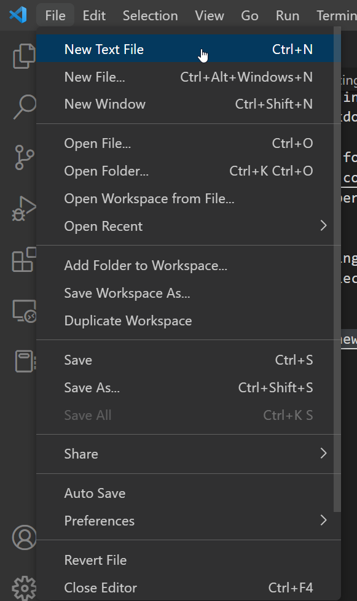

4. Choose Markdown where it says "Select a language".

   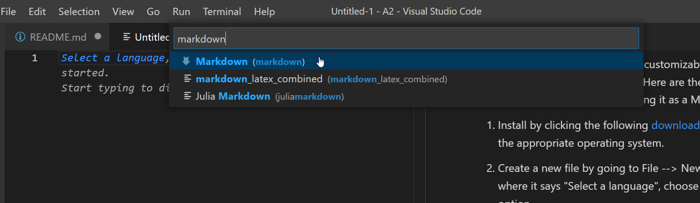
   
5. Preview your changes in real-time using the Live Preview option on the top right which opens a new tab with the changes.

   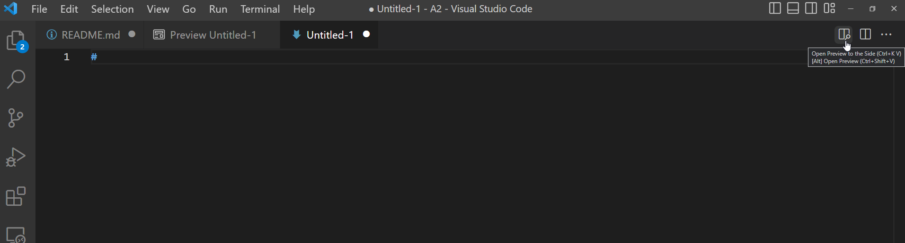

   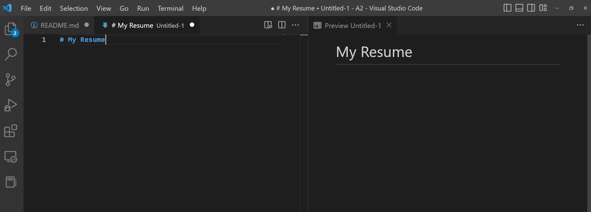

## Instructions

### GitHub Pages Setup

Hosting our resume over a static site hosting service such as GitHub Pages offers speed and simplicity (Etter, 2016, p. 26). Firstly, it gives you the power to correct content errors instantaneously and allows your content to be synchronized with the latest software release (Etter, 2016, p. 26). Moreover, all that is needed is the contents of your resume written in Markdown and a static site generator. It removes all the obstacles of server-side application dependencies, databases, and any installations (Etter, 2016, p. 26).

GitHub Pages is chosen as our hosting service since Jekyll offers built-in support for it which makes it easier for us to customize our content, including adding a theme. 

We will be using Git as a version control system given that it is used by GitHub Pages. Version control systems allow for collaboration as everyone can contribute to our documentation simultaneously. This is important as contributing is "one of the tenets of modern technical writing" (Etter, 2016, p. 19). Furthermore, Etter (2016) describes Git as amazing for tracking changes where we can see and merge related changes as well as view file logs and track the individual with problematic content (p. 38). Lastly, the most important reason to use Git or version control systems as a whole is that developers prefer them (Etter, 2016, p. 23). For instance, developers might feel reluctant to collaborate with technical writers if their preferred method is sending files over email.

Some basic Git operations we will be using are `clone`, `add`, `commit`, and `push`. A description of each operation can be found on git's website found in the  [More Resources](#More-Resources) section.

#### Creating a Github Account

1. Open the following [GitHub link](https://github.com/).

2. Click "Sign Up" on the top right of the screen.\
   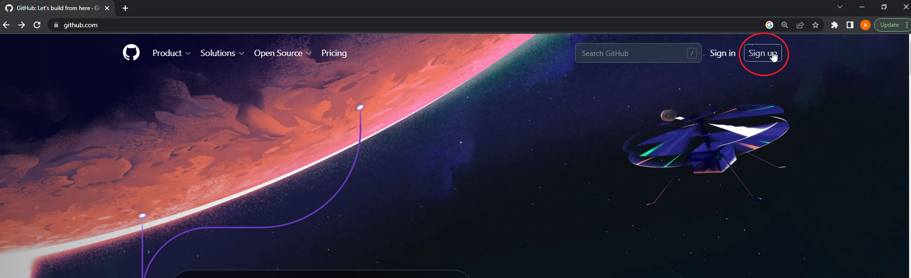

3. Enter your account details.\
   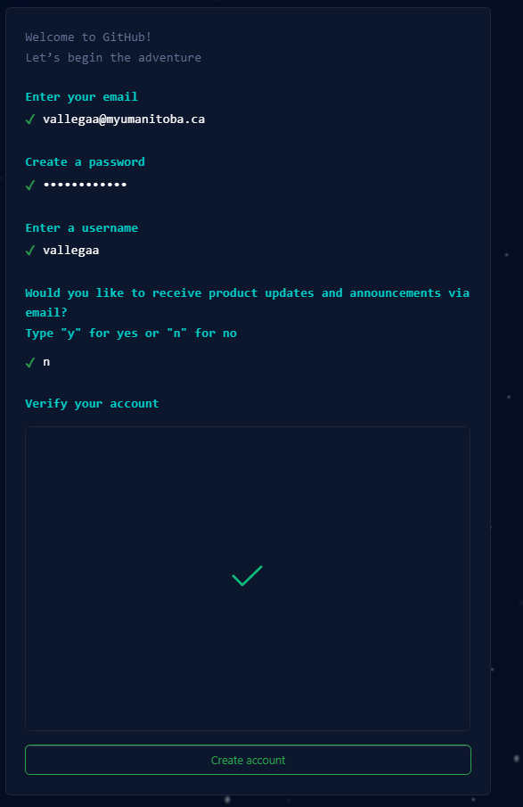

After completing the instructions above and personalizing your account, you should see a dashboard similar to below:

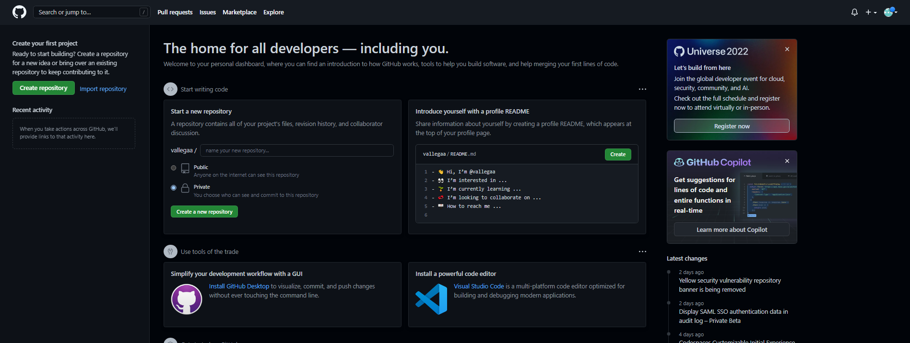

#### Creating a New Repository

1. Create a new repository from the GitHub homepage by either:
   - Clicking the "Create Repository" button,
   - Clicking the "Create New Repository" button (repository details listed in the next step), or
   - Clicking the "New Repository" option on the top right drop-down menu.

   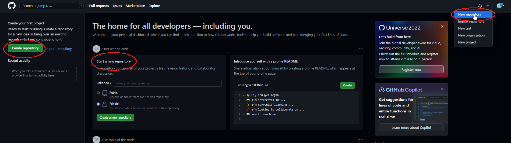

2. Enter the repository name as `username.github.io` where `username` represents your GitHub username.
   - The GitHub username can be seen under the "Owner" field.
3. Choose the repository visibility as Public.
   - Public is supported by GitHub Free and the Private option is only available with paid GitHub products.
4. Create the repository.
   - Optionally, you can add a description, `README.md`, and others to the repository.

An example is shown below:
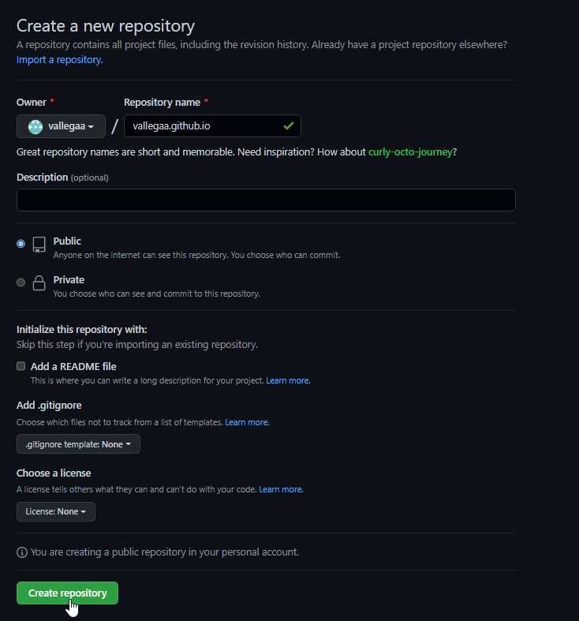

#### Configure Branch Source

We need to specify which branch to publish our resume. We will use the default branch `master` as our publishing source.
 
1. Click the "Settings" tab on your new GitHub repository.
   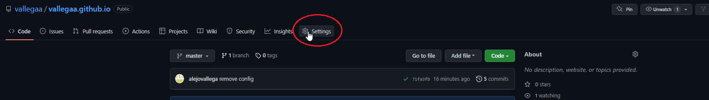

2. Click the "Pages" option under "Code and automation" in the sidebar.
   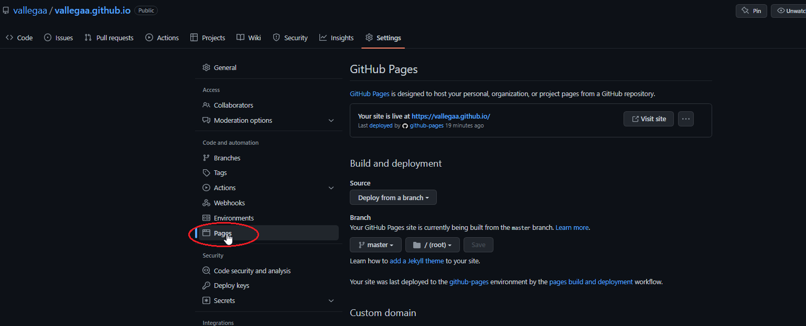

3. Choose the "Deploy from a branch" option as the source under "Build and deployment".
   

4. Select `master` as the branch under "Build and deployment"
   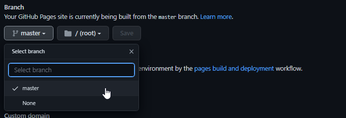

5. Select `(root)` as the folder under "Build and deployment"
   - Optionally, you can choose a separate folder, however by default, we will use root (`master`) as the folder location.

   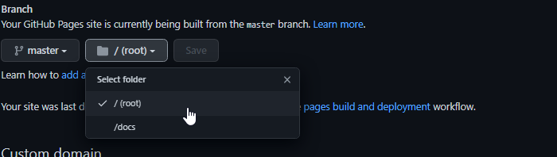

### Add Resume and Theme to Local Repository

GitHub Pages searches for an entry file (the default page) for the site which is named either `index.md`, `index.html` , or `README.md`. The entry file, `index.md`, will be used since your resume is written using Markdown. 

#### Clone and Add Resume to Repository

1. Clone the repository into your local environment using Visual Studio Code's built-in Git source control.
   - A demo is shown below:
   
      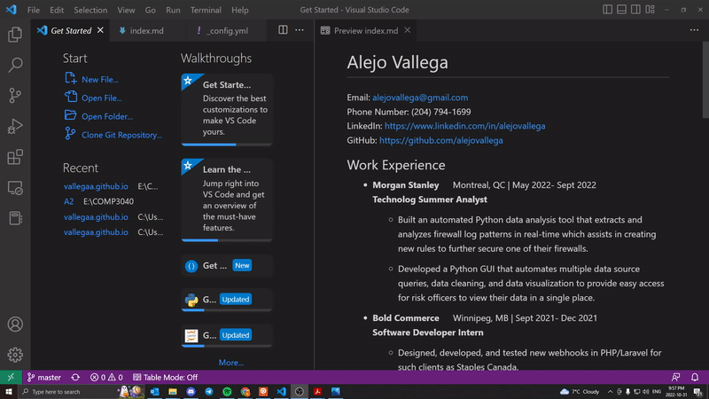
   
     Note that your repository should be empty, unlike the demo.
2. Add your resume to your local repository in Visual Studio Code.
  
3. Rename your resume file to `index.md`.
  
#### Add a Theme with Jekyll to your Local Repository

Static site generators such as Jekyll eliminates manually configuring and customizing the contents of your site. For instance, all a static generator needs are the content (lightweight markup) and a theme (templated HTML and CSS) and processes everything into a functional site (Etter, 2016, p. 26). 

Jekyll offers various configuration options when building your site such as themes, styling with CSS, and many others. This can all be done in a configuration file named `_config.yml`

1. Add a new file named `_config.yml` in your local repository in Visual Studio Code.
2. Select your desired theme that is supported by GitHub Pages [here](https://pages.github.com/themes/).
3. Note the theme name down displayed in the README of the theme's repository.
4. Add `theme: theme_name` to the `_config.yml` file.
   - `theme_name` is the theme name found in the step above.

#### Add Your Resume and Theme to your Site

1. Click Source Control on the left sidebar in Visual Studio Code.
2. Stage the new files `index.md` and `_config.yml`.
3. Add a commit message describing the new changes to the repository.
4. Commit the new changes.
5. Push the new changes. 
6. Check `username.github.io` to see if the changes are displayed.
   - Note that it may take a few minutes to display after pushing the changes.

Note that steps 4 and 5 can be done at the same time.

Steps 1-5 are shown in the demo below:
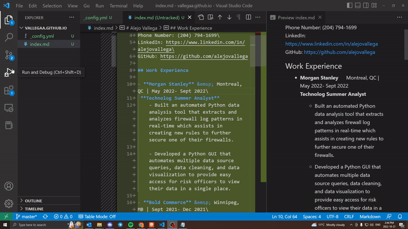

## More Resources
- [Basic Markdown Tutorial](https://www.markdowntutorial.com/)

- [GitHub Flavoured Markdown Tutorial](https://github.github.com/gfm/)

- [Git Operations](https://git-scm.com/docs/git)

## Authors and Acknowledgments:

- **Prabal Mendiratta**: Editor 
- **William Sutherland**: Editor
- **Vinh Tran**: Editor
- **Parker Moore**: Theme Template for Resume

## Frequently Asked Questions (FAQs)

1. "Why is Markdown better than a word processor?"
   
   - Firstly, documentation typically has a lifespan and "needs to be kept in version control" (Etter, 2016, p. 20). Lightweight markup languages such as Markdown are better suited for version control as opposed to a word processor as they are commonly used to be "consumed and discarded" (Etter, 2016, p. 20) and lacks version control. Furthermore, Markdown is free to use and can be written in most text editors. Whereas, many word processors require some sort of fee.

2. "Why is my resume not showing up?"
   - Ensure that your site's most recent build and deployment workflow run passed successfully by going to the Action tab on your repository. Common errors are listed below:
      - `_config.yml` file does not contain the proper theme name from the theme's `README.md`.
      - There is a Markdown syntax error in your `index.md`

   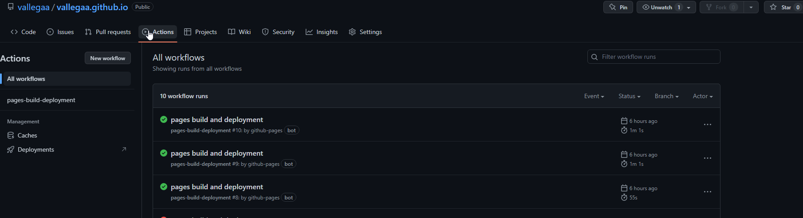     